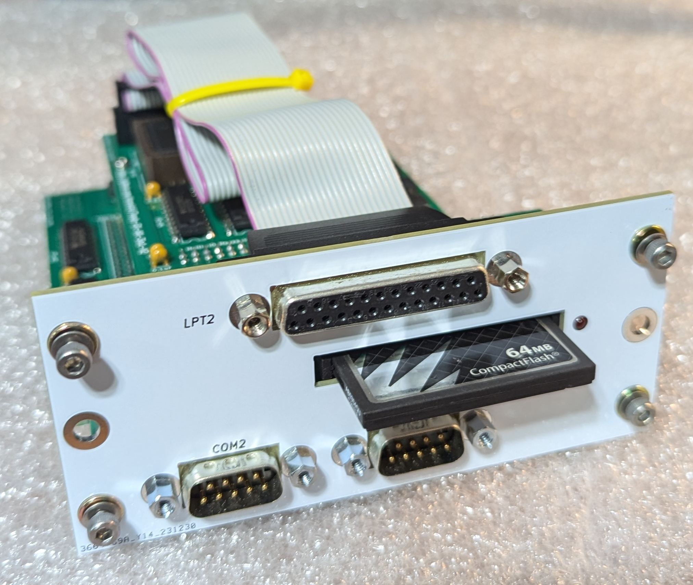

# Tandy 1000 EX/HX 3-in-1 Upgrade Version 2
The Tandy 1000 EX/HX 3-in-1 Upgrade Version 2 expands your 1000 EX or HX with some fantastic features!

## About
The Tandy 1000 EX and HX systems originally came with just 256Kb of system memory, no serial ports, no hard drive, and a non-standard expansion slot.  These limitations have made the EX and HX somewhat unattractive for the modern vintage computer enthusiast.  While there were contemporary ways to expand the system’s capabilities, such upgrades were somewhat uncommon and are difficult to obtain today.  The Tandy 1000 EX/HX 3-in-1 Upgrade overcomes these limitations by providing the following features:
* Fully expanded system memory - 640Kb conventional + 96Kb UMB 
* Standard DB9 RS232 Serial Port
* XT-IDE ‘CF Lite’ Interface
Compared to the original [Tandy 1000 EX/HX 3-in-1 Upgrade](https://github.com/leadacid44/Tandy-1000-EX-HX-3-in-1), version 2 provides two serial ports and a second parallel port, otherwise the upgrades are identical.

## Acknowledgements
This project is based on the work of [Rob Krenicki's Tandy 1000 EX/HX 3-in-1 Expansion Board V2.0 project](https://github.com/rkrenicki/Tandy-EX-HX-3in1-V2).  I created this fork in 2023.  The original idea and execution was Rob's, but a few small changes have been made:
* Modification of the mounting plate to accomodate the rivnut style connections, greatly improving board mount stability.
* The User's Guide was added

## Memory
The 3-in-1 V2 Upgrade uses a 4Mbit static random access memory (SRAM) chip1 to provide an additional 512 kilobytes of system memory.  In combination with the original 256Kb of system memory, your computer will now have a total of 768Kb of system memory configured as 640Kb of conventional memory, plus an additional 96Kb of UMB (Upper Memory Block) memory.

Historically, memory upgrades for the Tandy 1000 EX / HX (such as Tandy’s ‘Memory PLUS Expansion Adapter’ P/N 25-1062) provided an additional Direct Memory Access (DMA) controller to handle (among other things) the refresh timing for the adapter’s added DRAM memory.  As the 3-in-1 V2 Upgrade uses SRAM, which does not have such refresh requirements, the DMA functionality is not needed.  The presence or lack of DMA does not impact performance for most aspects of the system.

## I/O Ports
The 3-in-1 V2 Upgrade uses the Texas Instruments TL16C552   communications chip to provide two standard 16550-based serial RS-232 ports, as well as one enhanced bi-directional parallel printer port.  The serial ports are configured as ‘COM1’ and ‘COM2’ and are capable of communications of up to 115kbit/s.  The parallel port is configured as ‘LPT2’ and supports bidirectional communications.  The serial ports are perfect for connecting a serial mouse or communications with other systems, and the parallel port is perfect for connecting a printer, ZIP drive, Xircom Ethernet adapter, or other such parallel device.

## XT-IDE
The 3-in-1 V2 Upgrade implements a “XT-CF-lite rev.2” style XT-IDE adapter, which provides the standard XT-IDE Universal BIOS (XUB) and a CompactFlash socket that is accessible from the rear of your computer.

The most obvious function of XT-IDE is that it makes it possible to use a CompactFlash (CF) card as a solid-state hard disk.  A bootable, pre-formatted CF card has been included with your 3-in-1 Upgrade.  The CF card has a minimal version of FreeDOS 1.3, and has been tested and verified as working with your adapter.  A series of helpful utilities and example configurations for your Tandy EX / HX are also included.  This card will help you verify that the 3-in-1 adapter is functional, as well as aid in the process of installing the operating system of your choice.

Another extremely useful function of XT-IDE is that it is able to emulate a floppy drive over a serial connection.  This allows for booting of floppy images without the need for physical disks, and bypasses size limitations of the internal hardware.  Normally the Tandy 1000 EX / HX are limited to just 360k 5.25” or 720k 3.5” floppy disks, but with the XT-IDE software, it is possible to read, write, and boot 1.44MB floppy disk images.

## Compatibility
The 3-in-1 V2 Upgrade is only compatible with the Tandy 1000 EX or Tandy 1000 HX.  The upgrade is not compatible with any other PLUS slot expansion adapters and must be the only adapter installed - all other adapters must be removed.  Physically, the upgrade will take all three slots on the rear of your computer.

The Tandy 1000 EX / HX comes standard with a parallel port, but uses a card-edge style connector that was standard for Tandy at the time.  The upgrade provides a second parallel port (LPT2) using the more common DB-25 connector.  The upgrade does not interfere with operation of the first parallel port.

The upgrade’s CompactFlash interface is generally compatible with all CompactFlash cards, however as there are a wide variety of cards available, not all cards may work the same, or at all.  It is generally not recommended to use MicroSD-to-CF card adapters, nor MicroDrive style cards.  XTIDE has a size limit of 8.4GB, but there are also size limits based on your chosen OS.  For example, MS DOS 3.3 and older are limited to 32MB partitions, whereas 4.0 and higher can support 2GB partitions.  A 64 MB card is included with the adapter, which is generally enough for most things to do on an XT class machine.  For more details on compatible cards, consult the XT-IDE project documentation.

The upgrade is compatible with both the original Tandy 1000 EX / HX  Intel 8088 CPU, as well as the common NEC V20 CPU upgrade.  The upgrade ships with the standard XT-IDE R602 BIOS which is compatible with both processors, but an optional enhanced BIOS is available specifically for the NEC V20, which can improve disk performance.  Contact your dealer for more information.

The upgrade’s CompactFlash interface is generally compatible with all CompactFlash cards, however there are a wide variety of cards available, so not all cards may work the same, or at all.  Generally it is recommended to use a CompactFlash card smaller than 256MB.  It is generally not recommended to use MicroSD-to-CF card adapters, nor MicroDrive style cards.  For more details on compatible cards, consult the XT-IDE project documentation.

The 3-in-1 V2 Upgrade is compatible with both the Tandy 1000’s original Intel 8088 CPU, as well as the NEC V20 CPU.  An optional enhanced BIOS is available specifically for the NEC V20 CPU, which can improve disk performance.

## Configuration
The 3-in-1 Upgrade board requires no additional configuration for normal operation, and is ‘plug and play’.  There is one jumper, ‘J1’, which controls whether the XT-IDE EEPROM is in ‘Write Enable’ mode.  The default is for the jumper to be open (removed) to disable writes.  Unless you plan to write to the EEPROM, such as for on-system XT-IDE updates, it is strongly recommended that this jumper be left open.

### XT-IDE Serial Drives
An extremely useful function of XT-IDE is its ability to emulate a floppy drive over a null-modem serial connection to a host PC.  Operation of the XT-IDE serial drive feature is the same as any standard XT-IDE implementation, however there are a few tips specific to the Tandy 1000 EX / HX and the 3-in-1 Upgrade:
*  It has been found that version “2.0.0 Beta 3 (Apr 16 2019)” of ‘serdrive.exe’ is the most compatible with the Tandy 1000 EX / HX 3-in-1 Upgrade.  A copy of this version is available on the GitHub repository.
*  XT-IDE is able to use most common disk image sizes, as well as custom sizes. The Tandy 1000 EX / HX is able to read 360Kb, 720Kb, 1.2Mb, and 1.44Mb images, but is still limited by operating system compatibility.  For example, the built-in system ROM containing Tandy MS-DOS v2.11 does not support 1.44MB disks.
    • Booting from an emulated disk requires two keystrokes on the XT-IDE splash screen; first press ‘F6’ to perform the ComDetect, then press ‘B’ to boot from the emulated disk.  The internal disk drive letter ‘A’ will be swapped with the emulated disk drive letter ‘B’.
*  The maximum stable serial transfer speed is 115.2Kbps.
*  Occasionally, the ‘serdrive.exe’ program seemingly does not properly initialize the serial port on the host PC.  Generally this can be seen as the XT-IDE not detecting the emulated disk.  It has been found that running a serial terminal program like ‘TeraTerm’ or ‘PuTTY’ on the host PC, opening a connection to the COM port, and then closing that program, will properly ‘set up’ the COM port.  Once done, then the ‘serdrive.exe’ program will work as expected.

## License
This project is licensed under the Creative Commons - Attribution - ShareAlike 3.0 License

## Attribution
This board was derrived from works by, uses design elements from, or contains sofware writen by the following:
* Rob Krenicki (https://github.com/rkrenicki)
* Sergey Kiselev (http://www.malinov.com/Home/sergeys-projects)
* James Pearce (https://www.lo-tech.co.uk/)
* Adrian Black (https://www.youtube.com/user/craig1black/featured)
* Jacob Dorne of Monotech PCs (https://monotech.fwscart.com/)
* XTIDE Universal BIOS Team (http://www.xtideuniversalbios.org/)
* Assembly Instructions

